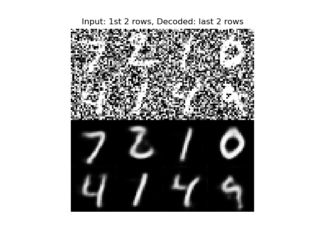

# Autoencoder-Denoiser

Usage of a basic autoencoder architecture with a noisy input.
The dataset used is the famous (for its simplicity) MNIST. A random noise is applied and the target is learn the basics of number recognition and denoise the input when given.

The architecture, as said, is a basic autoencoder made of encoder and decoder and the union of them.
Inspired in Advanced Deep Learning with Keras book I'm currently reading.

